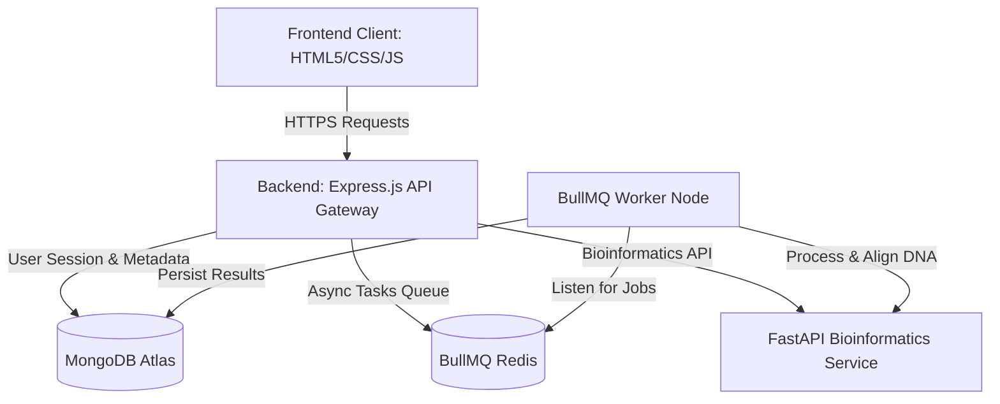

# 🧬 GeneLab AI — Complete System Overview & Capabilities Guide

This guide provides a comprehensive breakdown of the **GeneLab AI** platform, detailing the frontend user interface, backend architecture, MongoDB database schemas, core bioinformatics engines, and operational instructions.

---

## 🗺️ 1. Platform & Architecture Overview

GeneLab AI is an enterprise-grade web application tailored for clinical genomic workflow coordination and molecular biology research. It uses a secure microservices architecture to process heavy DNA analysis tasks asynchronously.

### System Architecture


1. **Frontend Client**: Built with HTML5, vanilla CSS, ES6+ Javascript, Tailwind CSS, and visualizers (GSAP, Chart.js).
2. **Express.js Gateway**: Acts as the security shield, routes API requests, validates JSON Web Tokens (JWT), and handles file uploads.
3. **FastAPI BioService**: A high-performance Python microservice utilizing BioPython, MyVariant.info, and NCBI BLAST.
4. **MongoDB Atlas**: Cloud database storing users, DNA records, diagnostic logs, and platform announcements.
5. **Redis & BullMQ**: Manages long-running deep genomic alignments.

---

## 🎨 2. Frontend Portals & Features

The user interface uses a unified glassmorphic theme with a responsive layout designed for both desktop and mobile viewports.

### A. Clinician (Doctor) Portal
* **Dashboard**: Monitor pending, active, and completed genomic analysis jobs.
* **Ingestion (Upload & Paste)**: Upload `.fasta`, `.fastq`, `.fna`, `.txt`, or `.csv` files or paste raw sequence strings. Supports real-time upload progress bars.
* **Interactive DNA Sequence Viewer**: Color-coded sequence viewer supporting drag-selection, zoom/pinch on touchscreens, live sub-sequence search, and quick FASTA copying.
* **Variant Inspector**: Interactive table displaying GC content, AT ratios, codon translation, open reading frames (ORFs), and clinical variant annotation (rsID check).
* **Clinical Review**: Add medical comments, approve report status, and stamp the physician's electronic signature.

### B. Researcher Portal
* **Global Sequence Registry**: Search, filter, and inspect genomic metadata across cohorts.
* **Genomic Alignment Comparator**: Side-by-side Needleman-Wunsch sequence alignment showing mutation density, similarity percentages, and mismatch indexes.
* **Population Analytics & Trends**: Dynamic population charts showing mutation types, demographics, and clinical diagnostic ratios.

### C. Ops-Control (Admin) Portal
* **User & Personnel Management**: Activate, review, suspend, or delete doctor and researcher accounts.
* **System Health Monitor**: Live check of API Gateway status, FastAPI BioService responsiveness, and Database connectivity.
* **Audit Ledger**: A secure, exportable CSV audit trail tracking user actions, timestamps, and resource IDs.
* **Settings & Banner Configuration**: Toggle maintenance modes and post global announcements.

### D. Global Header & Synchronized Notification Center
* **Live Profile Sync**: Updating your profile picture instantly updates the sidebar and header user menus without requiring a page refresh.
* **Real-time Notifications**: Custom dropdown that lists global administrator announcements *and* personal DNA job completions (analyzed or failed), built with XSS-safe DOM APIs to prevent injection.

---

## 💾 3. Database Schema Reference (MongoDB)

Here are the MongoDB collections and Mongoose schema designs that power GeneLab AI:

### A. Users Collection (`Users`)
Tracks credentials, profiles, roles, and verified statuses.
```javascript
const userSchema = new mongoose.Schema({
  name: { type: String, required: true },
  email: { type: String, required: true, unique: true },
  password: { type: String, select: false },
  role: { type: String, enum: ['doctor', 'researcher', 'admin', 'user'], default: 'user' },
  specialization: { type: String, default: '' },
  profilePicture: { type: String, default: '' }, // Supported by Supabase/Firebase uploads
  signatureUrl: { type: String, default: '' },
  isEmailVerified: { type: Boolean, default: false },
  isActive: { type: Boolean, default: true }
}, { timestamps: true });
```

### B. DNA Files Collection (`DNAFiles`)
Stores sequence metadata, clinical statuses, and FastAPI results.
```javascript
const dnaFileSchema = new mongoose.Schema({
  originalName: { type: String, required: true },
  filename: { type: String, required: true },
  path: { type: String, required: true },
  sequence: { type: String },
  sequenceLength: { type: Number },
  gcContent: { type: Number },
  status: { type: String, enum: ['uploaded', 'analyzing', 'analyzed', 'failed'], default: 'uploaded' },
  errorMessage: { type: String, default: '' },
  analysisType: { type: String, enum: ['instant', 'deep'], default: 'instant' },
  doctor: { type: mongoose.Schema.Types.ObjectId, ref: 'User' },
  clinicalStatus: { type: String, enum: ['Pending Approval', 'Approved', 'Needs Review'], default: 'Pending Approval' },
  notes: { type: String, default: '' },
  variantData: { type: Array, default: [] },
  blastResult: { type: Object, default: null }
}, { timestamps: true });
```

### C. Announcements Collection (`Announcements`)
Stores news posted by admins for all users.
```javascript
const announcementSchema = new mongoose.Schema({
  title: { type: String, required: true },
  content: { type: String, required: true },
  priority: { type: String, enum: ['low', 'medium', 'high'], default: 'low' },
  authorId: { type: mongoose.Schema.Types.ObjectId, ref: 'User', required: true },
  isActive: { type: Boolean, default: true }
}, { timestamps: true });
```

### D. Audit Logs Collection (`AuditLogs`)
Maintains an immutable ledger of administrative and clinical events.
```javascript
const auditLogSchema = new mongoose.Schema({
  userId: { type: mongoose.Schema.Types.ObjectId, ref: 'User' },
  action: { type: String, required: true }, // e.g. "USER_SUSPENDED", "DNA_APPROVED"
  details: { type: mongoose.Schema.Types.Mixed },
  ipAddress: { type: String },
  timestamp: { type: Date, default: Date.now }
});
```

---

## 🔌 4. API Endpoints & Bio-Calculations

### REST API Reference
| Method | Endpoint | Description | Protected |
| :--- | :--- | :--- | :--- |
| `POST` | `/api/auth/register` | Register new credentials | No |
| `POST` | `/api/auth/login` | Login and return JWT | No |
| `GET` | `/api/dna/my-files` | Get user-specific DNA sequence list | Yes |
| `POST` | `/api/analysis/instant-analysis` | Start fast BioPython analysis job | Yes |
| `POST` | `/api/analysis/deep-analysis` | Start deep BLAST alignment job | Yes |
| `PUT` | `/api/dna/file/:id/review` | Update notes and approval status | Yes |
| `GET` | `/api/announcements` | Fetch active announcements | Yes |

### Bioinformatics Engine Capabilities
* **GC/AT Content**: Calculates exact nucleotide frequencies:
  $$\text{GC Content} = \frac{G + C}{A + T + G + C} \times 100\%$$
* **Translation Frames**: Translates nucleotide sequences across all 6 frames using codon translation maps (handling standard Start `ATG` and Stop `TAA`, `TAG`, `TGA` bounds).
* **Local Alignment**: Runs localized Smith-Waterman / Needleman-Wunsch dynamic alignment scoring matches, mismatches, and gaps.
* **Remote NCBI BLAST**: Queues deep alignments directly through NCBI remote API endpoints.

---

## 🛠️ 5. Operational Commands & Setup

### Running Locally with Docker Compose
Ensure Docker is running and execute:
```bash
docker-compose up --build
```

### Database Seeding
To populate MongoDB with clean administrative accounts, sample doctors, researchers, and test DNA sequence records, run:
```bash
cd backend
node seed.js
```

### Manual Service Bootup (Development Mode)
If running services manually without Docker:
1. **Start Redis**: Launch on default port `6379`.
2. **Start FastAPI BioService**:
   ```bash
   cd bioservice
   python -m venv venv
   # Activate virtualenv (Windows: .\venv\Scripts\activate)
   pip install -r requirements.txt
   uvicorn main:app --host 0.0.0.0 --port 8000
   ```
3. **Start Express Server**:
   ```bash
   cd backend
   npm install
   npm run dev
   ```
