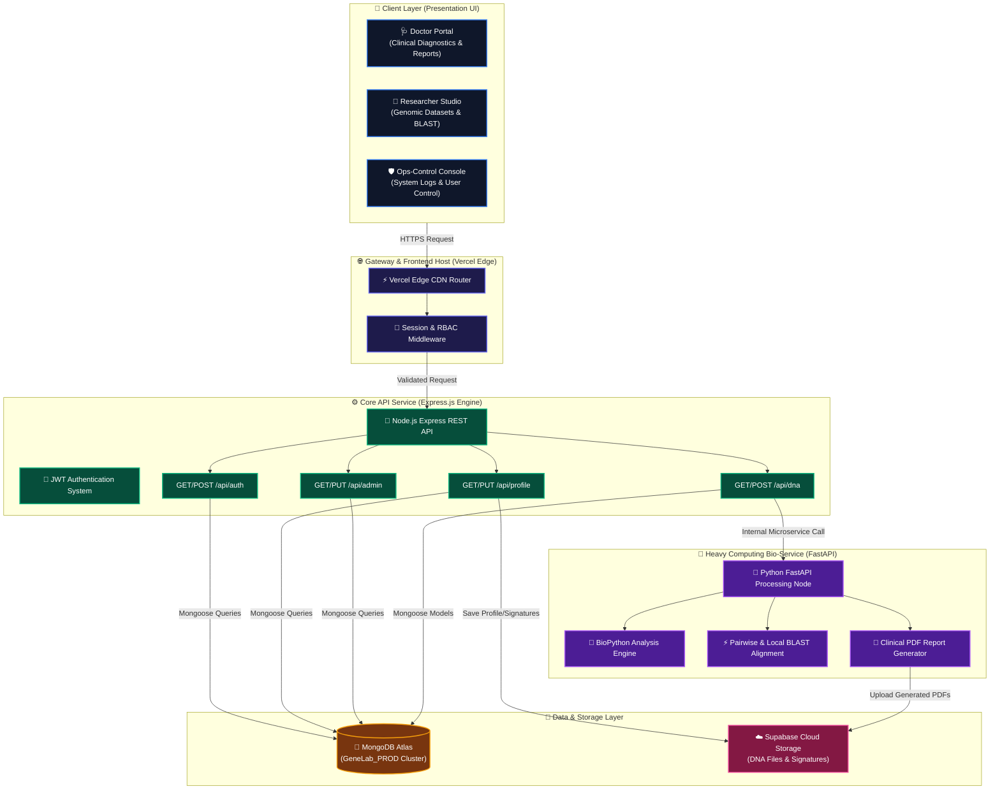

# 🏛️ GeneLab — System Architecture Specification & Presentation Diagram

**System Version:** 2.8.0  
**Target Environment:** Hybrid Vercel Serverless Edge + Node.js Express API + Python FastAPI Bio-Service + MongoDB Atlas Cluster (`GeneLab_PROD`)

---

## 🧬 System Architecture Diagram (Mermaid)



---

## 📂 Organised Clean Repository Map

```
genelab/
├── api/                      # Serverless API Proxy for Vercel
├── backend/                  # REST API Server (Express.js & Node.js)
│   ├── middleware/           # RBAC security & JWT guards
│   ├── models/               # Schemas (User, DNAFile, AuditLog, Note, SystemLog)
│   ├── routes/               # Modular REST endpoints
│   ├── services/             # Storage & BioService connectors
│   ├── utils/                # DB pool & helpers
│   ├── seed.js               # Database seeder
│   └── seed_ultra_fresh.js   # 100% Real Data Seeder Engine
├── bioservice/               # Heavy Computational Microservice (FastAPI & BioPython)
│   ├── engines/              # BLAST engines & PDF report generator
│   ├── main.py               # FastAPI entry point
│   └── requirements.txt      # Python dependencies
├── frontend/                 # Client UI (HTML5, Vanilla CSS, JS ES6+)
│   ├── css/                  # Glassmorphism design tokens
│   ├── js/                   # Central API wrapper & modules
│   └── pages/                # Isolated Role View Dashboards
│       ├── doctor/           # Doctor Clinical Workspace
│       ├── researcher/       # Researcher Metagenomics Studio
│       └── ops-control/      # Admin Security Ops-Control Dashboard
└── System_Architecture.md    # Master Architecture Technical Document
```
