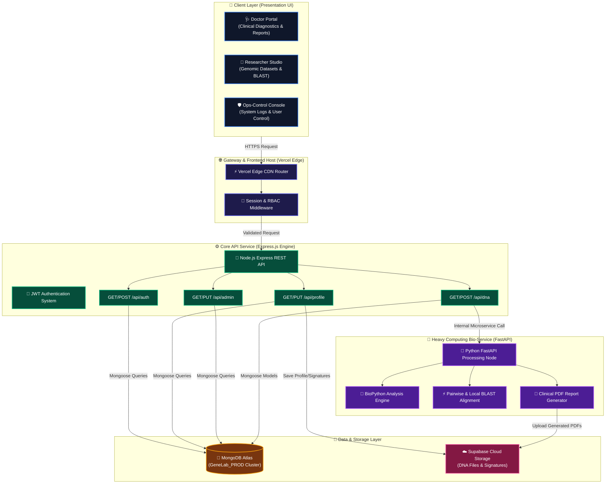

# 🏛️ GeneLab — System Architecture & Design Specification

**Version:** 2.8.0  
**Deployment Scheme:** Hybrid Vercel Serverless + Express API Engine + FastAPI Bio-Service + MongoDB Atlas  

---

## 🧬 System Architecture Diagram (Mermaid)

Below is the complete presentation-ready system architecture diagram illustrating the interaction between the **Client Layer**, **Gateway Layer**, **Express Backend API Engine**, **Python FastAPI Bio-Service Computing Node**, and **MongoDB Atlas Persistence Layer**:



---

## 📂 1. Clean File Structure Map

```
genelab/
├── api/                      # Vercel Serverless Function Handler
│   └── index.js              # Serverless bridge to Express backend
├── backend/                  # REST API Server (Express.js)
│   ├── middleware/           # Auth guard, error handlers, rate-limiters
│   ├── models/               # Mongoose Schemas (User, DNAFile, AuditLog, Note, SystemLog)
│   ├── routes/               # API endpoints (auth, dna, admin, profile, announcements)
│   ├── services/             # Integrations (Supabase Storage, BioService)
│   ├── utils/                # Database pool connection, logger, emails
│   ├── server.js             # Express app setup
│   ├── seed.js               # Primary Database Seeder
│   └── seed_ultra_fresh.js   # Ultra-Comprehensive 100% Real Data Seeder Engine
├── bioservice/               # Heavy Computing Engine (Python FastAPI)
│   ├── engines/              # BLAST alignment engines, BioPython, ReportLab PDF generators
│   ├── main.py               # FastAPI entry point
│   └── requirements.txt      # Python dependencies (Biopython, reportlab, fastapi)
├── frontend/                 # Client UI (HTML, CSS, JS)
│   ├── css/                  # Glassmorphism design tokens & styles
│   ├── js/                   # Central API wrapper (api.js), auth.js, result.js, profile.js
│   ├── pages/                # Isolated pages per role
│   │   ├── doctor/           # Doctor Result, Profile, and Reports
│   │   ├── researcher/       # Dataset Exploration dashboards
│   │   ├── ops-control/      # Admin control center (Ops-Control Dashboard)
│   │   └── login.html        # Portal entry page
│   └── theme.css             # Unified visual tokens and themes
├── scripts/                  # Deployment & Maintenance Utility Scripts
└── tools/                    # Development & QA tools
```

---

## 🗄️ 2. MongoDB Schema Specifications (`GeneLab_PROD`)

All documents are stored within MongoDB Atlas in the **`GeneLab_PROD`** database. Below are the core Mongoose schemas:

### 2.1 User Collection (`users`)
```javascript
const userSchema = new mongoose.Schema({
  name: { type: String, required: true },
  email: { type: String, required: true, unique: true, lowercase: true },
  password: { type: String, select: false },
  role: { type: String, enum: ['doctor', 'researcher', 'admin', 'employee'], default: 'doctor' },
  organization: { type: String },
  specialization: { type: String },
  licenseNumber: { type: String },
  phone: { type: String },
  profilePicture: { type: String, default: '' },
  signatureUrl: { type: String, default: '' },
  isActive: { type: Boolean, default: true },
  isEmailVerified: { type: Boolean, default: false }
}, { timestamps: true, collection: 'users' });
```

### 2.2 DNA Sequence Collection (`dna_sequences`)
```javascript
const dnaFileSchema = new mongoose.Schema({
  originalName: { type: String, required: true },
  filename: { type: String, required: true },
  path: { type: String, required: true },
  sequence: { type: String },
  sequenceLength: { type: Number },
  gcContent: { type: Number },
  atContent: { type: Number },
  nucleotideFrequency: { A: Number, T: Number, G: Number, C: Number, N: Number },
  molecularWeightDa: { type: Number },
  status: { type: String, enum: ['uploaded', 'analyzing', 'analyzed', 'failed'], default: 'uploaded' },
  doctor: { type: mongoose.Schema.Types.ObjectId, ref: 'User', required: true },
  patientId: { type: String },
  patientAge: { type: Number },
  biologicalSex: { type: String },
  clinicalIndication: { type: String },
  clinicalStatus: { type: String, enum: ['Pending Approval', 'Approved', 'Needs Review'], default: 'Pending Approval' },
  variants: [{ variantId: String, gene: String, clinicalSignificance: String, severity: String }],
  blastResult: { topOrganism: String, topIdentity: Number, topAccession: String, topEvalue: Number }
}, { timestamps: true, collection: 'dna_sequences' });
```

---

## 🔒 3. Role Permission Matrix

Strict Role-Based Access Control (RBAC) enforced across all API routes:

| Role | Clinical DNA Upload | Review & Sign Memos | Research BLAST Search | Admin Console | System Log Audit |
|---|---|---|---|---|---|
| **Admin** | ❌ No | ❌ No | ❌ No |  Yes |  Yes |
| **Doctor** |  Yes |  Yes | ❌ No | ❌ No | ❌ No |
| **Researcher**| ❌ No | ❌ No |  Yes | ❌ No | ❌ No |

---

## ⚡ 4. REST API Specification

All paths are prefixed by `/api`. Every call must supply a JWT bearer header (`Authorization: Bearer <token>`).

### 4.1 Authentication Service (`/api/auth`)
*   `POST /api/auth/register` - Create user account. Body: `{ name, email, password, role }`.
*   `POST /api/auth/login` - Authenticate user. Returns JWT token and user metadata.
*   `GET /api/auth/me` - Fetch profile metadata for logged-in user.

### 4.2 DNA Management Service (`/api/dna`)
*   `POST /api/dna/upload` - Upload FASTA/TXT sequence.
*   `GET /api/dna/my-files` - List sequence files for the active user.
*   `PUT /api/dna/file/:id/review` - Save clinical review details and status.

### 4.3 Admin Service (`/api/admin`)
*   `GET /api/admin/stats` - Platform total counts (users, sequences, active jobs).
*   `GET /api/admin/audit-logs` - Security audit trail list.
*   `GET /api/admin/system-logs` - Performance and error execution logs.
