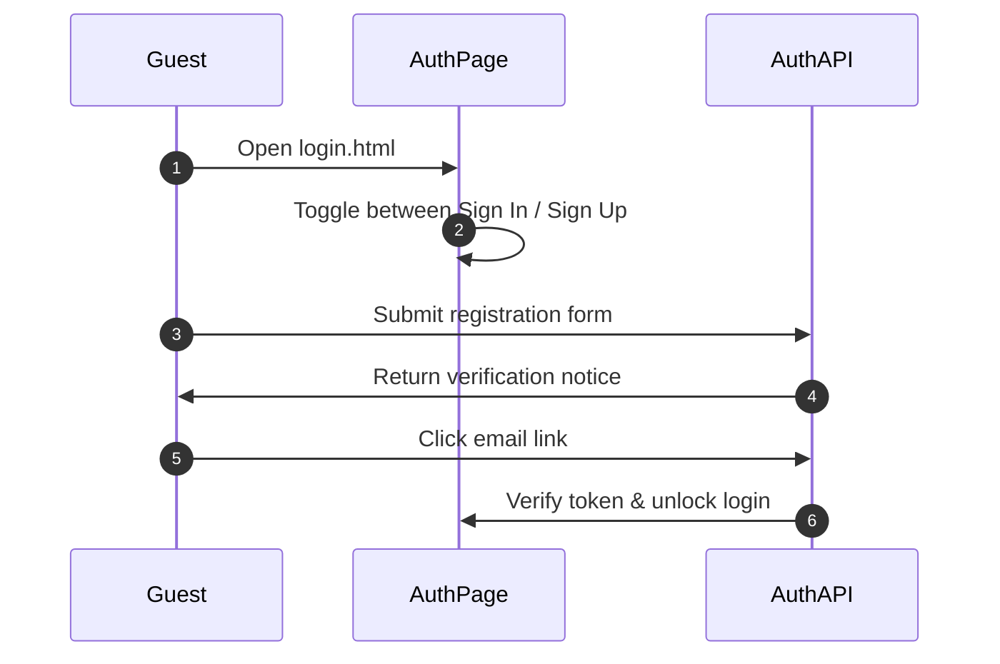
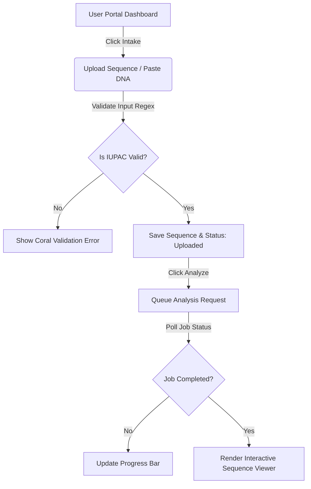
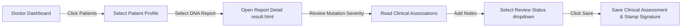
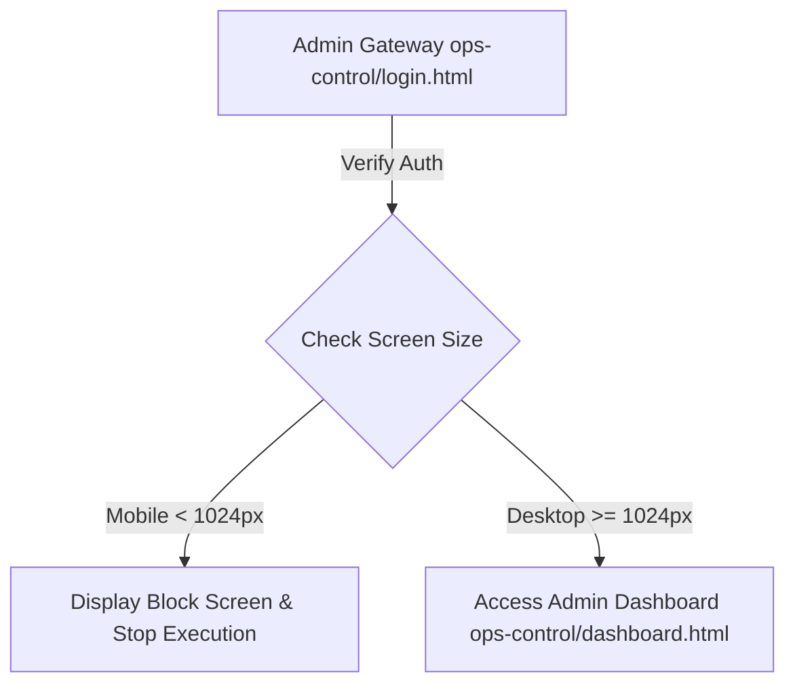

# 🎨 GeneLab — UI/UX Specification

**Version:** 2.0.0  
**Design Paradigm:** Premium Glassmorphism & Dark Sci-Fi Aesthetic  

---

## 1. Visual Design System

GeneLab utilizes a cohesive visual theme defined in `theme.css` to present biological data.

### 1.1 Color Systems & Semantics
We use harmonic HSL color ranges to prevent flat designs and create clear diagnostic hierarchy:

| Variable | Color Representation | Semantic Usage |
|---|---|---|
| `--cyan` | `#00d4ff` (Bright Cyan) | Primary actions, DNA markers, GC indicators |
| `--teal` | `#06ffa0` (Neon Teal) | Successful operations, Approved reports, active jobs |
| `--violet` | `#a78bfa` (Soft Violet) | Research operations, multiple sequence alignments |
| `--coral` | `#ff6b6b` (Vibrant Coral) | Pathogenic variants, deleted assets, failed jobs |
| `--ink` | `#020617` (Deep Slate Black) | Core layout backgrounds |
| `--border` | `rgba(255, 255, 255, 0.08)` | Glass panel borders |

### 1.2 Typography
*   **Headers & Accents**: `Outfit` (sans-serif) — tracking-wide, bold, geometric.
*   **Body Content**: `Inter` (sans-serif) — clean, readable at 11px/12px sizes.
*   **Sequence Display**: `Fira Code` / `JetBrains Mono` (monospace) — clean base alignments.

### 1.3 Design Elements (Glassmorphism)
All cards use high-gloss transparency layers overlaying background animations:
```css
.glass-panel {
  background: rgba(15, 23, 42, 0.45);
  backdrop-filter: blur(12px);
  border: 1px solid rgba(255, 255, 255, 0.08);
  box-shadow: 0 8px 32px 0 rgba(0, 0, 0, 0.37);
}
```

---

## 2. UI/UX Information Architecture

```
                                    ┌───────────────────────┐
                                    │    Public Homepage    │
                                    └───────────┬───────────┘
                                                │
                     ┌──────────────────────────┼──────────────────────────┐
                     ▼                          ▼                          ▼
           ┌──────────────────┐       ┌──────────────────┐       ┌──────────────────┐
           │   User Portal    │       │  Doctor Portal   │       │Researcher Portal │
           └─────────┬────────┘       └─────────┬────────┘       └─────────┬────────┘
                     │                          │                          │
      ┌──────┬───────┼───────┐           ┌──────┼───────┐           ┌──────┼───────┐
      ▼      ▼       ▼       ▼           ▼      ▼       ▼           ▼      ▼       ▼
    Dash   Upload Analyze Reports      Dash  Patients Review      Dash  Upload Explorer
```

### 2.1 Navigation Hierarchies
1.  **Sidebar-Driven Control Panels**: All active portals (User, Doctor, Researcher, Admin) use a fixed left-side navigation layout.
2.  **Top Header**: Displays the current section badge, screen title, dark mode toggler, and quick logout button.
3.  **Active Workspace**: Generous padding (2rem) containing responsive grid containers (1, 2, or 3 columns).

### 2.2 Dashboard Analytics & Charting Layouts
Every dashboard page displays structural performance graphs:
*   **GC Content Indicator**: Radial gauge displaying percentage GC composition.
*   **Base Composition Donut Chart**: Proportions of Adenine, Thymine, Guanine, Cytosine.
*   **Codon Frequency Histograms**: Shows frequency distributions of translated amino acids.
*   **Variant Severity Distributions**: Bar graph detailing mutation frequencies (High, Moderate, Modifier, Low).

---

## 3. Frontend Page Flows

Below are the navigational steps mapping user interaction paths.

### 3.1 Authentication & Registration Flow


### 3.2 User Intake & Bioinformatics Analysis Flow


### 3.3 Doctor Review & Approval Flow


### 3.4 Admin Control Block (Desktop-Only Guard)


---

## 4. Interaction Guidelines & State Behaviors

*   **Hover states**: All buttons scale slightly (`scale-102`) and transition background opacity (`duration-300`).
*   **Loading Indicators**: Operations (such as running BLAST or saving profile settings) must display a spinning indicator (`material-symbols-outlined animate-spin`).
*   **Form Errors**: Validation errors appear underneath form inputs with coral highlights.
